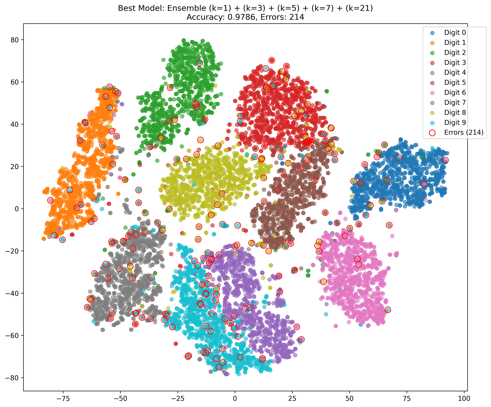

# knnEnsemble

**knnEnsemble** for homogeneous data classification like MNIST, competitive with CNN architectures. To compare with CNN architectures, we consider the results documented on [Wikipedia](https://en.wikipedia.org/wiki/MNIST_database#Classifiers). We seek competitive accuracy with CNN methods on the handwritten digit MNIST classification without requiring deep learning.

These classification models to see initial publication at IV25.

## Dimensionality Reduction

We applied dimensionality reduction by cutting 2px and 3px from the boundary of all train and evaluation data. Using kNN with k=3, both cutoffs achieved the same accuracy. We choose to use the 3px cutoff for smaller dimensionality.

- Original size: 28 × 28 = 784
- After 3px cutoff: 22 × 22 = 484
- After 2x2 kernel and stride 2 pooling: 11 × 11 = 121

Dimensionality reduction ratio:

121/784 = 0.1543 or about 84.57% reduction

## Results

### 1. Majority Vote Ensemble

Current results are training on all 60k train cases and testing on all 10k test cases, CV in progress for further comparison.

Using an ensemble of k-NN classifiers with one vote per model:

- Best model: (k=1) + (k=3) + (k=5) + (k=7) + (k=21)
- Accuracy: 0.9786
- Mistakes: 214
- Second best ensemble: (k=1) + (k=3) + (k=5) + (k=7) + (k=15)
- Accuracy: 0.9783
- Mistakes: 217

### 2. Weighted Vote Ensemble

Inspired by succesful work with CNN voting [Vu 2025] we test vote combinations of 1,2,…,10 votes assigned to each of the 5 individual k-NN classifiers. Interestingly, the weighted combinations have many tying model capabilities.

Allowing multiple votes per classifier:

- Best model: 1×(k=1) + 1×(k=3) + 1×(k=5) + 2×(k=7) + 1×(k=21)
- Accuracy: 0.9789
- Mistakes: 211

Another top model:

- 2×(k=1) + 1×(k=3) + 1×(k=5) + 3×(k=7) + 1×(k=21)
- Accuracy: 0.9789
- Mistakes: 211

Error rate: 2.11%

## License Information

This project is licensed under the MIT License, allowing free use for both personal and commercial purposes. For full terms, see the `LICENSE` file.
